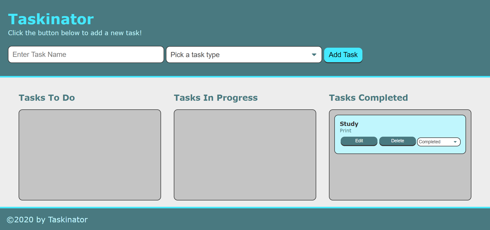

# Taskinator-Planning App
With this project users are able to schedule tasks for themselves by name and choosing th etype of task it is for them. They are able to use the drag and drop feature to put the task into three categories of to do, in progress, or completed. They can edit the tasks as well with a dropdown menu attached to each task.

## Languages and tools used.
1. HTML5
2. CSS3
3. JavaScript

### Application can be deployed here: https://joshcarter8400.github.io/Taskinator/

